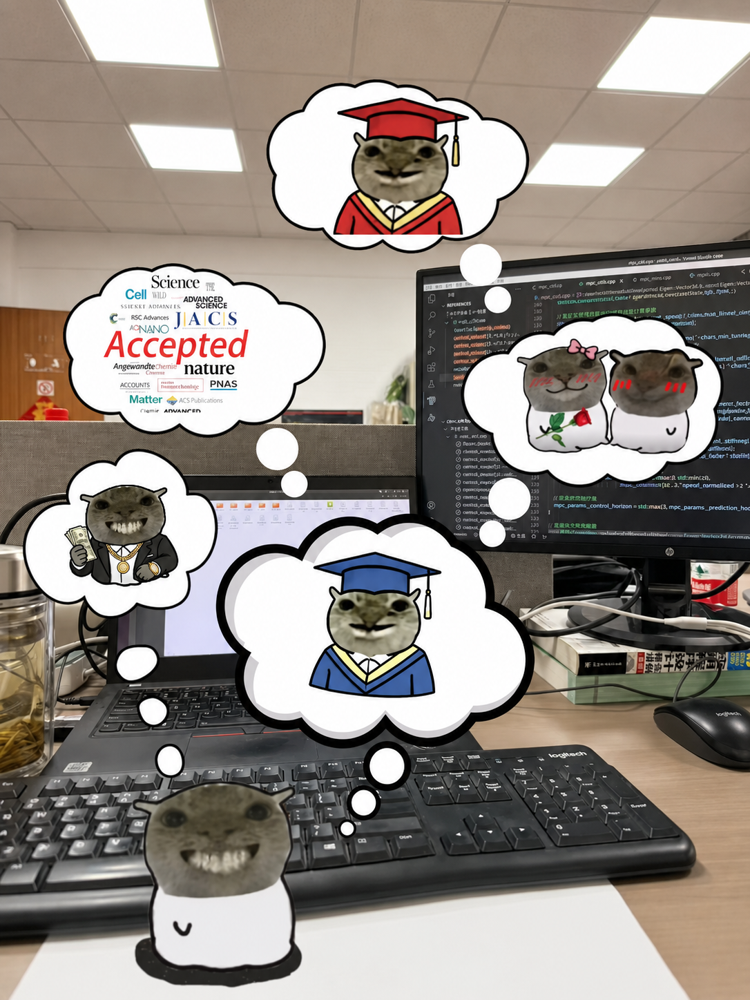

::: {.home-intro}

::: {.columns}

::: {.column width="58%"}

## 前言

虽然日常总是琐事偏多，代码跑不出来，作业写不完，论文看不懂，钱包还很安静。

但问题不大，鼠鼠我呀，还是很会做梦的。梦里我已经毕业了，论文发了，钱赚到了，爱情也来了，整只鼠都闪闪发光。

就像阿尔都塞说的那样：“生活，尽管有悲剧，但毕竟还可以是美好的。”

:::

::: {.column width="42%"}

{width="100%"}

:::

:::

:::
## 文章列表